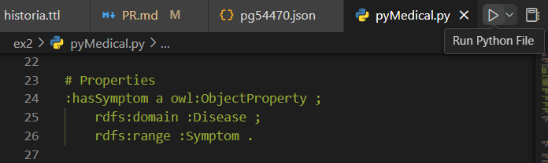

# RPCW2024-Normal

### Info ex1

No exercício 1 foi criado uma ontologia através da aplicação Protege.

Classes: `Pessoa, Animal, Fazenda, Feira, Produto, TrabalhadorTemporario (subclasse de Pessoa) e Agricultor (subclasse de Pessoa)`. 

Object Properties: `Contrata, Cultiva, Possui, Protege, Troca, Usa e Vende`.

Data Properties: `locFazenda, locFeira, nomeAnimal, nomePessoa e tipoProduto`.

Foram então adicionados os individuos, tendo em conta o que cada um fazia. 

Foram adicionados 1 individuo que não constava no texto, mas era necessário para a query "Quem contrata trabalhadores Temporários", chamado `Alberto_e_Romeu`, de modo a existir alguém que contratasse essas pessoas, no caso do texto o `SrJoao`, designadas com a subclasse `TrabalhadorTemporario`.

### Info ex2

Além do que é pedido no enunciado, realizei algumas alterações no json, devido a alguns nomes terem "` ' `" e outras excessões tinham um ponto final no fim. Decidi então remover esses "`'`" e pontos finais, pois dessa forma não iria existir erros no ttl.
Também havia na `Description` da `Jaundice`, a parte `""morbus regius""`, onde tinha duas vezes no ínicio e no fim as aspas, decidi remover para não haver também erros no ttl à posteriori. 

Para correr o script, basta clicar naquele ícone "Run Python File", claro que estando no destinatário correto, no meu caso `...\RPCW2024-Normal\ex2>` 

No entanto, demora um pouco a correr.

Depois de criados os ttls, focamo-nos no `med_doentes.ttl`, onde vai ser usado para criar as queries SPARQL, importando o ttl no GraphDB.

Na alínea 12, é criado um construct, o qual temos de fazer download do que é dado, em formato ttl, e importar para depois continuar os exercícios à frente.

